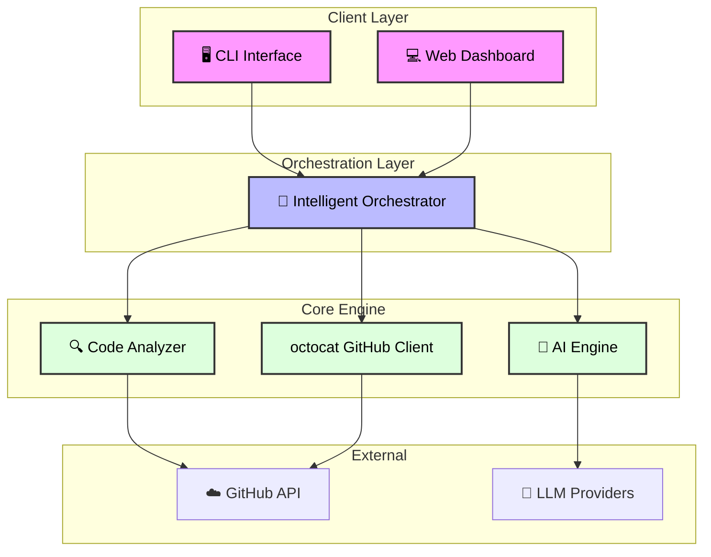
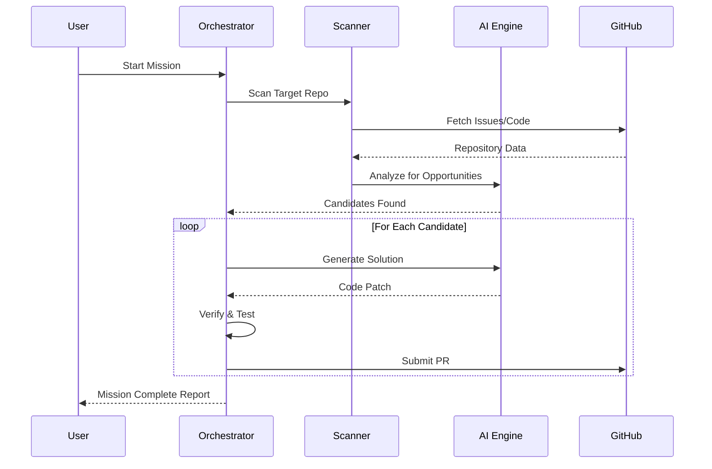
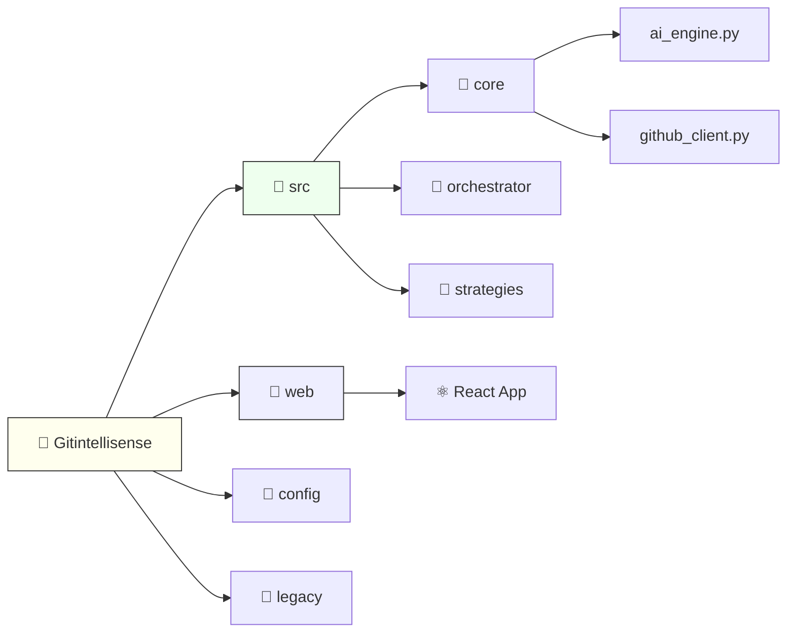

# Gitintellisense

<div align="center">


**The Ultimate AI-Powered GitHub Repository Scanner & Automated Contribution System**

[](https://opensource.org/licenses/MIT)
[](https://www.python.org/downloads/)
[](https://reactjs.org/)
[]()

[Features](#features) • [Installation](#installation) • [Usage](#usage) • [Architecture](#architecture) • [Dashboard](#dashboard) • [Contribution](#contribution)

</div>

---

## 🚀 Introduction

**Gitintellisense** is a sophisticated, autonomous AI agent designed to revolutionize how developers interact with open-source repositories. It doesn't just scan code; it **understands** it. By leveraging advanced machine learning and natural language processing, Gitintellisense identifies real contribution opportunities, generates high-quality pull requests, and orchestrates the entire contribution lifecycle.

Whether you are a maintainer looking to automate bug fixes or a contributor identifying high-impact issues, Gitintellisense serves as your intelligent pair programmer.

## ✨ Features

- **🧠 Cognitive Code Analysis**: Deep semantic understanding of codebase structure and logic using `AIEngine`.
- **🤖 Autonomous PR Factory**: Generates, tests, and submits pull requests automatically.
- **🔍 Smart Opportunity Detection**: Scans repositories for "good first issues", bugs, and optimization opportunities.
- **📊 Real-time Dashboard**: A beautiful React-based web interface to track contributions and system status.
- **🔗 Multi-LLM Support**: Integrated with OpenAI, Anthropic, and Gemini for diverse code generation strategies.
- **🛡️ Safety First**: Comprehensive sandboxed execution and verification before submission.

## 🏗️ System Architecture

Gitintellisense is built on a modular architecture designed for scalability and intelligence.

### High-Level Architecture



### Data Flow & Logic

The system follows a strict pipeline to ensure quality contributions.



## 📦 Installation

Prerequisites: Python 3.11+, Node.js 16+

### Backend Setup

1.  **Clone the repository:**
    ```bash
    git clone https://github.com/MrDecryptDecipher/Gitintellisense.git
    cd Gitintellisense
    ```

2.  **Create a virtual environment:**
    ```bash
    python3 -m venv venv
    source venv/bin/activate
    ```

3.  **Install dependencies:**
    ```bash
    pip install -r requirements.txt
    pip install -e .
    ```

4.  **Configure Environment:**
    Copy `.env.example` to `.env` and add your GitHub Token and API Keys.
    ```bash
    cp .env.example .env
    ```

### Frontend Dashboard Setup

1.  **Navigate to web directory:**
    ```bash
    cd web
    ```

2.  **Install Node dependencies:**
    ```bash
    npm install
    ```

3.  **Start the Dashboard:**
    ```bash
    npm start
    ```

## 🛠️ Usage

### Command Line Interface

Run the intelligent scanner on a target repository:

```bash
gitintellisense scan --repo owner/repo --depth deep
```

Generate a contribution automatically:

```bash
gitintellisense contribute --issue 123 --auto-submit
```

### Web Dashboard

Access the dashboard at `http://localhost:3000` to visualize:
- Active scanning missions.
- Success rates of generated PRs.
- Real-time logs and system health.

## 📂 Project Structure



## 🛡️ License

This project is licensed under the MIT License - see the [LICENSE](LICENSE) file for details.

---
<div align="center">
    Made with ❤️ by <a href="https://github.com/MrDecryptDecipher">MrDecryptDecipher</a>
</div>
